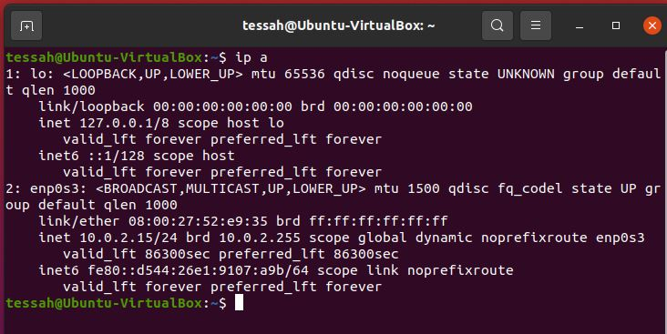
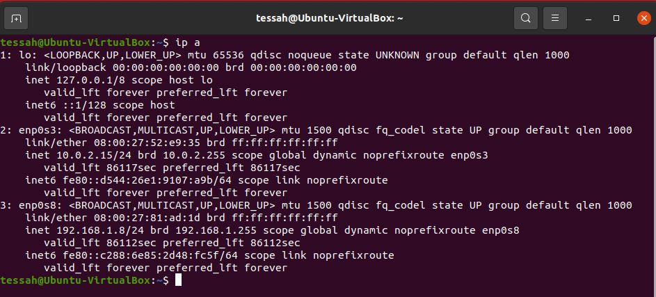
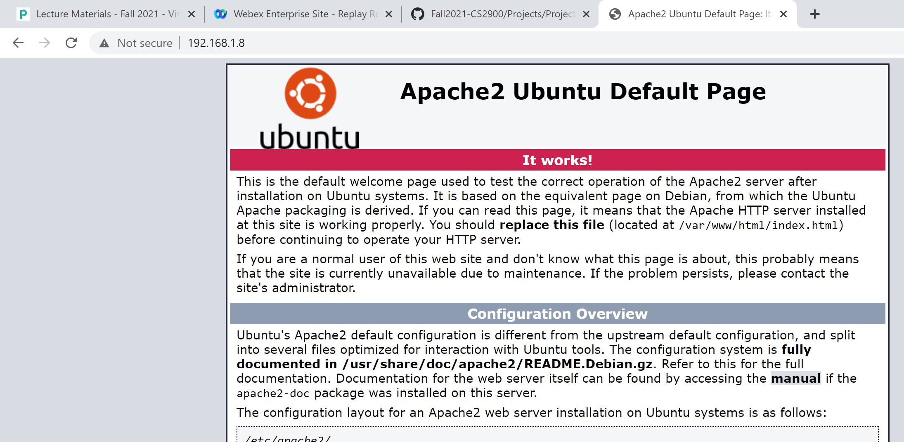

# Project 1 Documentation
## Part 1
- I opened VirtualBox and created and selected Linux as my VM type and Ubuntu as my version. I allocated 2048 MB of RAM. I then selected VDI as my virtual hard disk file type. I am dynamically allocating storage so that way it does not immediately take up all the space that I give it. I chose the reccomended size and gave my VM 10GB of storage. In the storage settings of my VM I added an Ubuntu 20.04 ISO. After completing the installation process, I inserted the guest additions CD, which will install drivers that allow for better screen resolution and mouse integration. I clicked run on the pop-up and it completed the installation. I rebboted my VM and resized the window so that it is now full screen. I also went into the display settings and turned on 3D acceleration.

## Part 2
- I cannot access the files created in the guest directory from my host machine. Using the shared folder feature the VM can view files on the host machine but it does not work the other way around.
- The snapshot that I created takes up 2 MB. It stores the state of the virtual machine at the time the snapshot was taken. It keeps a change log for the virtual disk as well as the VM settings, hardware configuration, and memory state. It is used to revert the VM back to a specific point in time. Since I am using VirtualBox I had to create a clone instead of a template. The clone takes up 8.9 GB of storage. It is an exact copy of my original VM and keeps all of those same settings including the hostname and network configuration.

## Part 3
- I chose to set up a bridged network on my VM. Inside of settings, I went to the network portion and enabled a second network adapter. I set this one to bridged adapter and then restarted my VM. I checked the IP settings and confirmed that another IP had been assigned to my VM and it was on the same subnet as my host machine which is 192.168.1.0/24. To verify that it worked I went to my host and typed the IP into the browser to confirm that the Apache page would load.

IP config before setting up the bridged network.

IP config after setting up the bridged network.

Verifying that my VM can be reached from my host.